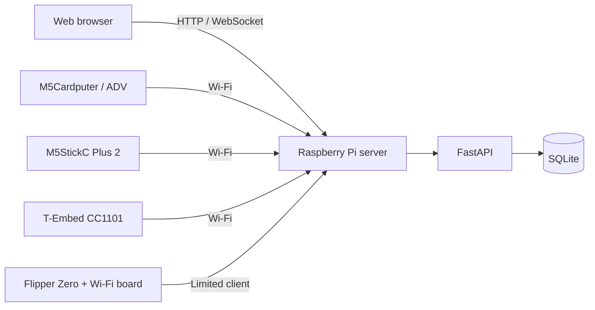

<div align="center">


# ESP32Chat

**A self-hosted local chat platform for Raspberry Pi, browsers, and handheld ESP32 devices.**

[](https://github.com/NoTimeToSleep-Team/esp32chat/actions/workflows/software-verification.yml)


[English](README.md) · [Русский](README.ru.md) · [Documentation](docs/README.md) · [Report a bug](https://github.com/NoTimeToSleep-Team/esp32chat/issues/new/choose)

</div>

> [!WARNING]
> ESP32Chat is an early alpha. The server and software verification paths are implemented, but full real-hardware validation is still pending. Do not use the current release for critical or production systems.

## What is ESP32Chat?

ESP32Chat runs a private chat server on hardware you control. A Raspberry Pi hosts the FastAPI application, web interface, database, and realtime WebSocket transport. Browsers and supported handheld devices connect as clients over the local network.

The project is intended for local networks, hardware experimentation, education, and self-hosted communication without a mandatory external cloud service.

## Highlights

- Self-hosted FastAPI server for Raspberry Pi and other ARM Linux systems.
- Realtime chat over WebSocket.
- Browser-based chat, account, blog, support, device, and administration pages.
- Public and private chat rooms with roles and access controls.
- SQLite storage, migrations, logging, backups, incidents, and safe-operation endpoints.
- Native client entry points for M5Cardputer, M5StickC Plus 2, T-Embed CC1101, and Flipper Zero.
- Automated software verification through GitHub Actions.

## Architecture



External clients communicate through the server API. They do not access the database directly.

## Current client status

| Client | Repository status | Hardware status |
|---|---|---|
| Web browser | Implemented | Software verification available |
| M5Cardputer / Cardputer ADV | Native runtime present | Validation pending |
| M5StickC Plus 2 | Native runtime present | Validation pending |
| T-Embed CC1101 | Native runtime present | Validation pending |
| Flipper Zero | Limited native FAP client | Validation pending; networking depends on external hardware |

See the [device matrix](docs/device-matrix.md) and [known limitations](docs/known-limitations.md) for the exact boundaries of each target.

## Quick start

### Requirements

- Python 3.10 or newer
- Git
- A supported desktop Linux, macOS, Windows, or Raspberry Pi environment

### Start the development server

```bash
git clone https://github.com/NoTimeToSleep-Team/esp32chat.git
cd esp32chat/server

python -m venv .venv
source .venv/bin/activate
python -m pip install --upgrade pip
python -m pip install -e .
python -m uvicorn app.main:app --reload
```

On Windows PowerShell, activate the virtual environment with:

```powershell
.venv\Scripts\Activate.ps1
```

Open these addresses after startup:

- Chat interface: `http://127.0.0.1:8000/chat`
- Health check: `http://127.0.0.1:8000/health`
- Readiness check: `http://127.0.0.1:8000/health/ready`

The commands above use the development profile. Before exposing ESP32Chat to a network, configure explicit allowed origins and a strong session secret as described in the [server documentation](server/README.md).

## Raspberry Pi deployment

Deployment assets are maintained under the server directory:

- [Raspberry Pi deployment guide](server/docs/deploy-pi.md)
- [Raspberry Pi Zero 2 W guide](server/docs/deploy-pi-zero2w.md)
- `server/scripts/` for installation and network helpers
- `server/systemd/` for service definitions
- `server/config/nginx/` for reverse-proxy configuration

Review the scripts before running them and test on a non-critical installation first.

## Device firmware

Native device entry points and shared runtime code are located under `firmware/`.

- Device implementations: `firmware/devices/`
- Shared Arduino runtime: `firmware/arduino/`
- Device profiles: `firmware/profiles/`
- [Build guidance](firmware/docs/build.md)
- [Native runtime map](firmware/docs/native-runtime-map.md)

Client and administrative write actions may be disabled by default and enabled through compile-time configuration. Never commit Wi-Fi passwords, account credentials, private keys, or server tokens.

## Repository layout

```text
server/        FastAPI server, web UI, data layer, and Raspberry Pi deployment
firmware/      ESP32, M5Stack, and Flipper Zero clients and verification harnesses
contracts/     Protocol and synchronization contracts
cardputerzero/ CardputerZero-specific launcher and deployment assets
docs/          Architecture, validation, operations, and project documentation
```

## Verification

Install the development dependencies and run the same software sweep used by CI:

```bash
python -m pip install -e "./server[dev]"
python docs/tools/run_software_verification_sweep.py --with-compileall
```

Software verification is not a substitute for real-device testing. Hardware results should include the board revision, toolchain, firmware commit, network topology, logs, and exact reproduction steps.

## Project status and roadmap

The current public release is an engineering alpha. Main priorities are:

1. Complete repeatable real-hardware validation for active devices.
2. Simplify Raspberry Pi installation and recovery.
3. Publish tested firmware binaries and reproducible build instructions.
4. Add real screenshots, photographs, and a short end-to-end demonstration.
5. Improve documentation for first-time contributors.
6. Prepare a stable, versioned protocol and release process.

The detailed internal roadmap is available in [PLAN.md](PLAN.md).

## Contributing

Bug reports, hardware test results, documentation corrections, translations, and code contributions are welcome. Start with [CONTRIBUTING.md](CONTRIBUTING.md), then check the [open issues](https://github.com/NoTimeToSleep-Team/esp32chat/issues).

Good first contributions include:

- Testing one supported device and publishing reproducible results.
- Improving setup instructions for Windows or Raspberry Pi.
- Adding screenshots or a short demonstration video.
- Fixing documentation inconsistencies.
- Improving error messages and reconnect behavior.

## Security

Do not publish credentials, Wi-Fi passwords, session tokens, private server addresses, or sensitive logs in an issue. Follow [SECURITY.md](SECURITY.md) for private vulnerability reports.

## License

ESP32Chat is distributed under the [MIT License](LICENSE). Third-party components remain subject to their own licenses.
