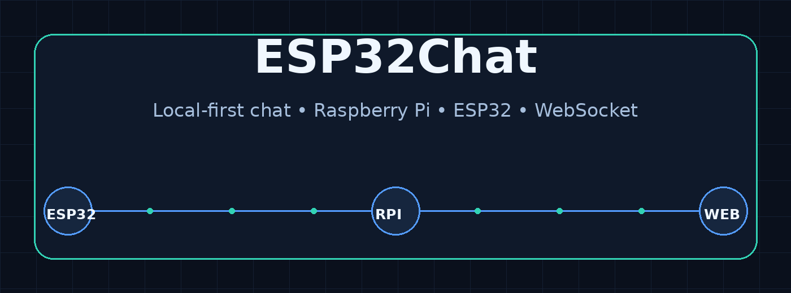
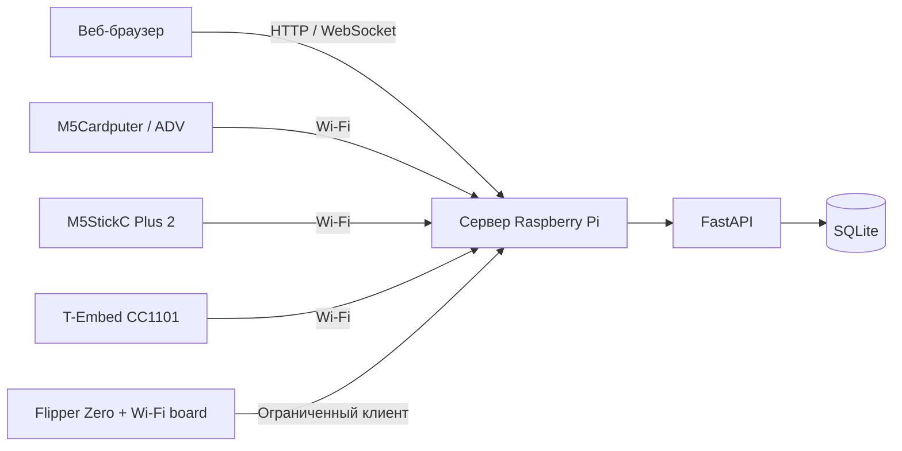

<div align="center">



# ESP32Chat

**Локальный self-hosted чат для Raspberry Pi, браузеров и портативных устройств на ESP32.**

[](https://github.com/NoTimeToSleep-Team/esp32chat/actions/workflows/software-verification.yml)


[English](README.md) · [Русский](README.ru.md) · [Документация](docs/README.md) · [Сообщить об ошибке](https://github.com/NoTimeToSleep-Team/esp32chat/issues/new/choose)

</div>

> [!WARNING]
> ESP32Chat находится на стадии ранней альфы. Сервер и программные проверки реализованы, но полная проверка на реальном оборудовании ещё не завершена. Не используйте текущий выпуск в критических или производственных системах.

## Что такое ESP32Chat?

ESP32Chat запускает приватный чат-сервер на вашем оборудовании. Raspberry Pi размещает FastAPI-приложение, веб-интерфейс, базу данных и WebSocket-транспорт. Браузеры и поддерживаемые портативные устройства подключаются к нему как клиенты через локальную сеть.

Проект предназначен для локальных сетей, экспериментов с оборудованием, обучения и общения без обязательного внешнего облачного сервиса.

## Возможности

- Self-hosted FastAPI-сервер для Raspberry Pi и других ARM Linux-систем.
- Чат в реальном времени через WebSocket.
- Веб-страницы чата, аккаунта, блога, поддержки, устройств и администрирования.
- Публичные и приватные комнаты, роли и ограничения доступа.
- SQLite, миграции, журналирование, резервные копии и операционные API.
- Нативные точки входа для M5Cardputer, M5StickC Plus 2, T-Embed CC1101 и Flipper Zero.
- Автоматические программные проверки через GitHub Actions.

## Архитектура



Внешние клиенты используют API сервера и не обращаются к базе данных напрямую.

## Состояние клиентов

| Клиент | Состояние в репозитории | Проверка оборудования |
|---|---|---|
| Веб-браузер | Реализован | Доступны программные проверки |
| M5Cardputer / Cardputer ADV | Есть нативный runtime | Ожидается |
| M5StickC Plus 2 | Есть нативный runtime | Ожидается |
| T-Embed CC1101 | Есть нативный runtime | Ожидается |
| Flipper Zero | Ограниченный нативный FAP-клиент | Ожидается; сеть зависит от внешнего оборудования |

Точные ограничения находятся в [матрице устройств](docs/device-matrix.md) и документе [Known Limitations](docs/known-limitations.md).

## Быстрый запуск

### Требования

- Python 3.10 или новее
- Git
- Linux, macOS, Windows или Raspberry Pi

### Запуск сервера для разработки

```bash
git clone https://github.com/NoTimeToSleep-Team/esp32chat.git
cd esp32chat/server

python -m venv .venv
source .venv/bin/activate
python -m pip install --upgrade pip
python -m pip install -e .
python -m uvicorn app.main:app --reload
```

В Windows PowerShell активируйте окружение командой:

```powershell
.venv\Scripts\Activate.ps1
```

После запуска откройте:

- Чат: `http://127.0.0.1:8000/chat`
- Проверка состояния: `http://127.0.0.1:8000/health`
- Проверка готовности: `http://127.0.0.1:8000/health/ready`

Эти команды используют профиль разработки. Перед публикацией сервера в сети настройте разрешённые источники и сильный секрет сессии согласно [документации сервера](server/README.md).

## Raspberry Pi

- [Основное руководство](server/docs/deploy-pi.md)
- [Руководство для Raspberry Pi Zero 2 W](server/docs/deploy-pi-zero2w.md)
- Скрипты установки: `server/scripts/`
- Сервисы systemd: `server/systemd/`
- Конфигурация Nginx: `server/config/nginx/`

Проверяйте скрипты перед запуском и сначала используйте некритичную тестовую систему.

## Прошивки устройств

- Реализации устройств: `firmware/devices/`
- Общий Arduino runtime: `firmware/arduino/`
- Профили устройств: `firmware/profiles/`
- [Инструкция по сборке](firmware/docs/build.md)
- [Карта нативных runtime](firmware/docs/native-runtime-map.md)

Не добавляйте в Git Wi-Fi-пароли, данные аккаунтов, приватные ключи и серверные токены.

## Проверка проекта

```bash
python -m pip install -e "./server[dev]"
python docs/tools/run_software_verification_sweep.py --with-compileall
```

Программные тесты не заменяют испытания на реальных устройствах. В отчёте указывайте ревизию платы, toolchain, commit прошивки, топологию сети, логи и точные шаги воспроизведения.

## Участие в разработке

Изучите [CONTRIBUTING.md](CONTRIBUTING.md) и [открытые задачи](https://github.com/NoTimeToSleep-Team/esp32chat/issues). Особенно полезны аппаратные тесты, исправления документации, переводы, скриншоты и улучшение установки.

## Безопасность

Не публикуйте секреты, Wi-Fi-пароли, session tokens, приватные адреса сервера и чувствительные логи. Для уязвимостей используйте инструкции из [SECURITY.md](SECURITY.md).

## Лицензия

ESP32Chat распространяется по [лицензии MIT](LICENSE). Сторонние компоненты могут использовать собственные лицензии.
